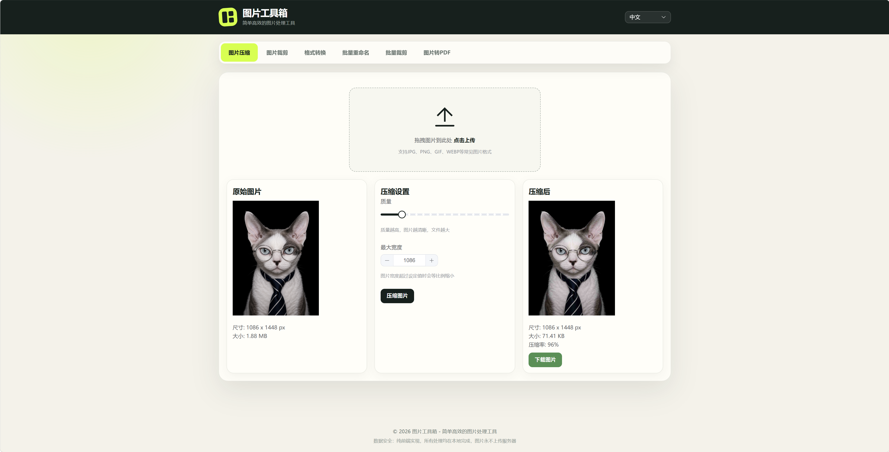

# PicKit - 图片工具箱

一个简单高效、完全在浏览器本地运行的在线图片处理工具。

## 在线访问

https://pic-kit.vercel.app/

## 界面预览



## 功能

- **图片压缩**：调整图片质量和尺寸，减小文件体积
- **图片裁剪**：自由裁剪图片，支持多种宽高比例
- **格式转换**：在 PNG、JPEG、WebP 等格式之间转换
- **批量重命名**：批量重命名图片并打包下载
- **批量裁剪**：统一裁剪多张图片

## 技术栈

- Vue 3 + Vite
- Element Plus
- Canvas API
- Pica
- Cropper.js

## 本地运行

双击 `start.bat`，或执行：

```bash
npm install
npm run dev
```

构建生产版本：

```bash
npm run build
```

## 特点

- 纯前端实现，图片不会上传服务器
- 无需注册登录
- 支持中文、英文和日文
- 支持 PWA

## 许可证

MIT
